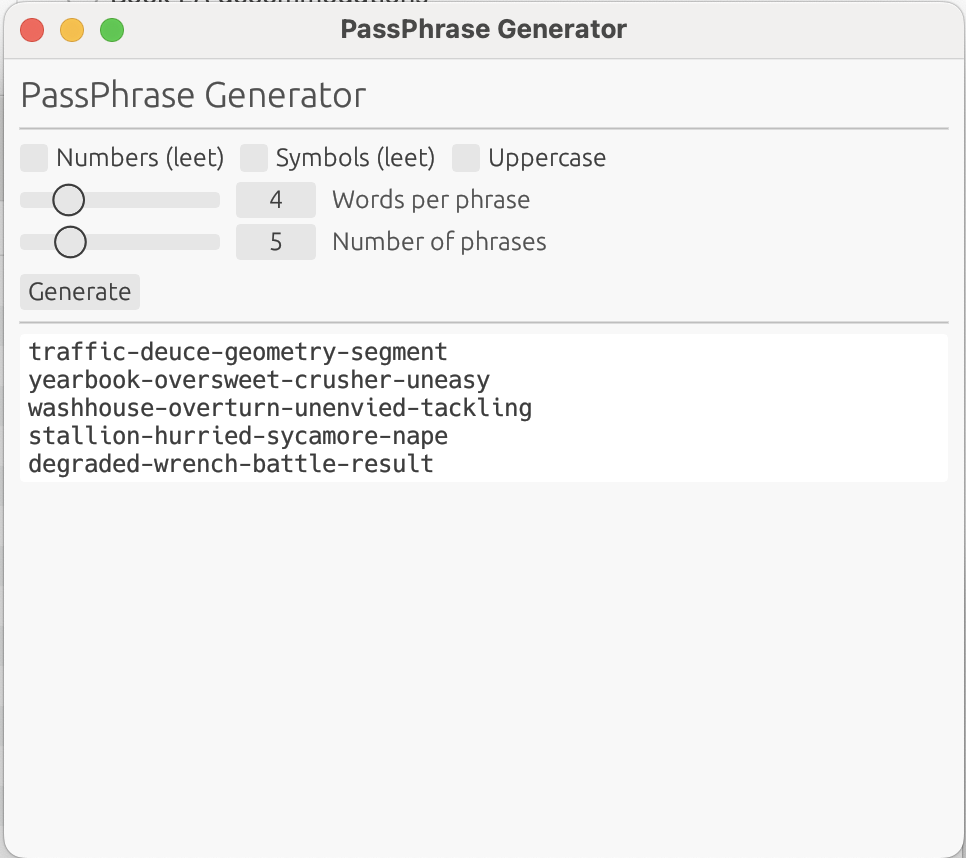

# PassPhrase Generator

A native desktop app for generating secure, memorable passphrases using the [EFF large wordlist](https://www.eff.org/deeplinks/2016/07/new-wordlists-random-passphrases).



## Features

- Generate multiple passphrases at once
- Control the number of words per phrase (2–12)
- Optional leet-speak substitutions:
  - **Numbers** — replaces letters with digits (`e→3`, `o→0`, `a→4`, `l→1`)
  - **Symbols** — replaces letters with symbols (`a→@`, `s→$`, `i→!`)
- **Uppercase** — capitalizes the first letter of each word
- Output is selectable and copyable directly from the text area

## Building

Requires [Rust](https://rustup.rs/) (edition 2024).

```sh
cargo build --release
```

The binary will be at `target/release/pass_phrase`.

## Running

```sh
cargo run --release
```

## Testing

```sh
cargo test
```

## Wordlist

Passphrases are drawn from the EFF large wordlist (7,776 words), embedded at compile time. This wordlist was designed specifically for diceware-style passphrase generation and contains common, memorable English words.

## License

Apache License 2.0 — see [LICENSE](LICENSE).
